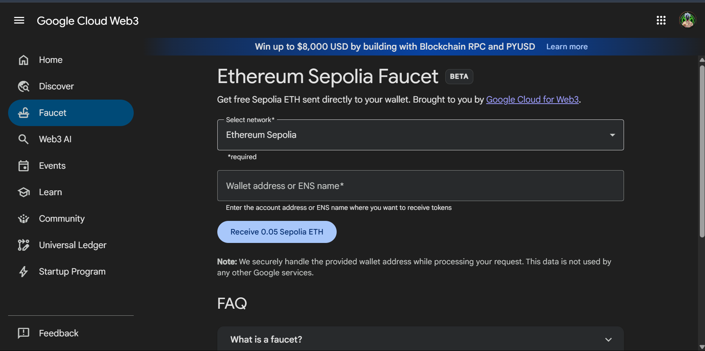
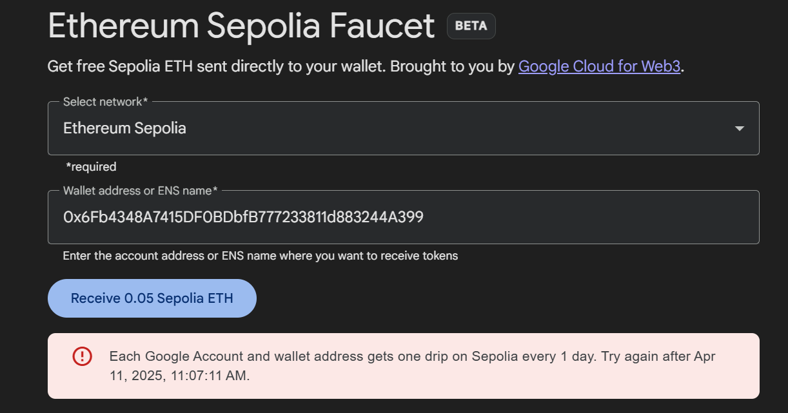
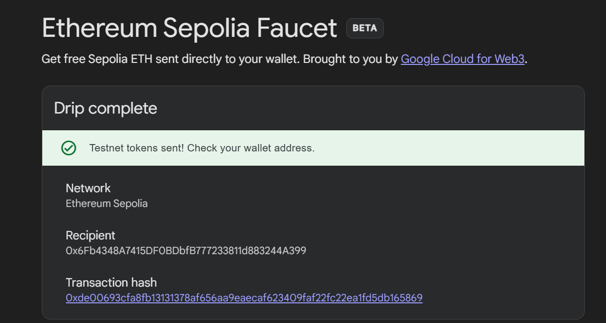
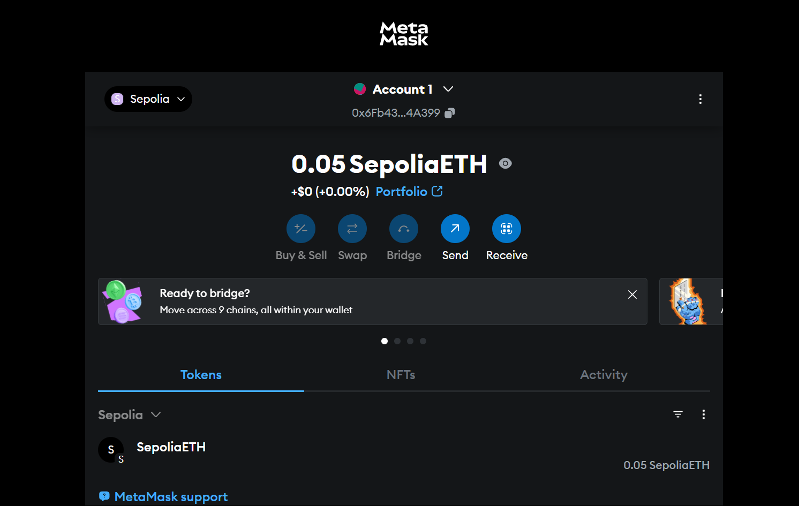
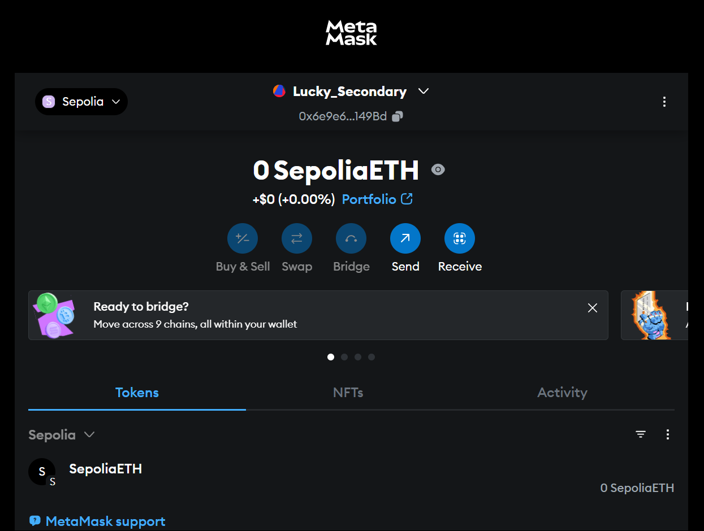
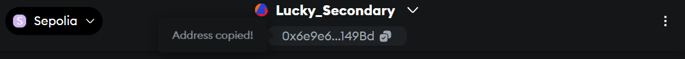
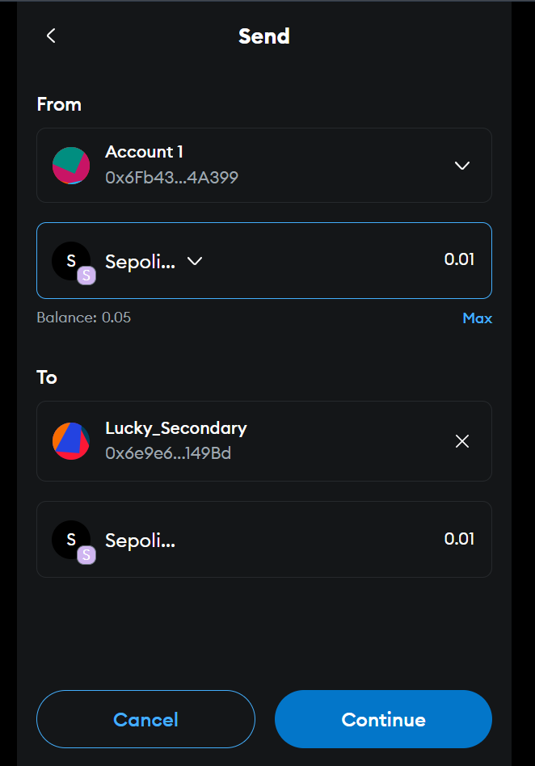
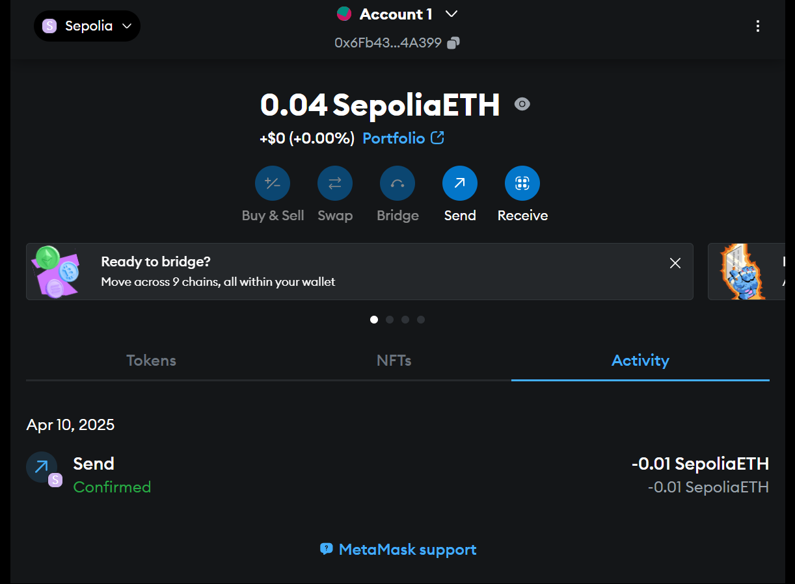
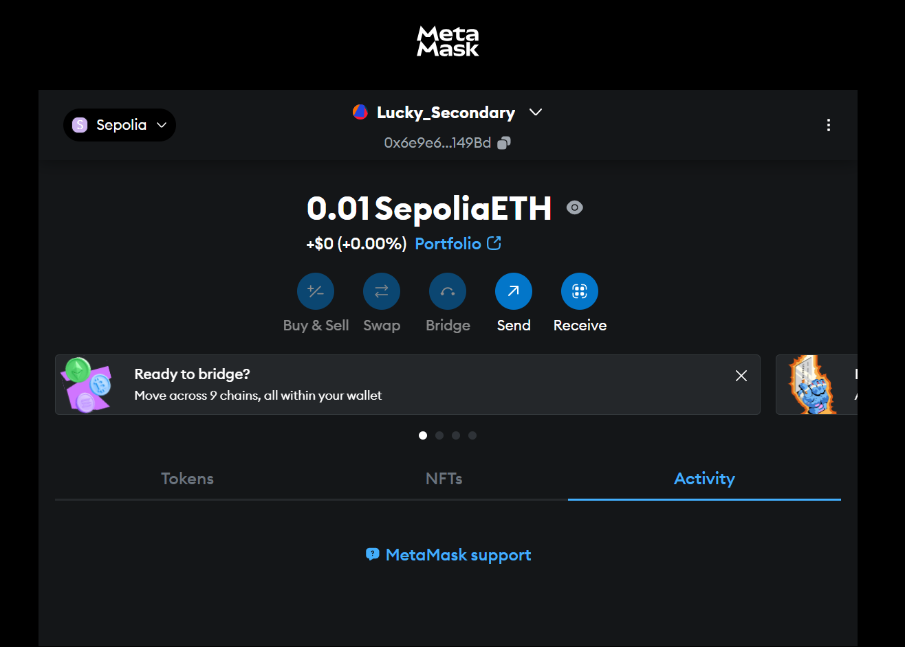

# 🚀 MetaMask & Sepolia Test ETH Assignment

## 🧾 Overview
This assignment provides a detailed walkthrough of how to work with MetaMask and the Ethereum Sepolia Test Network. It includes installing the MetaMask wallet, configuring it with the Sepolia test network, acquiring test ETH from the Google Cloud Faucet, and transferring ETH between two MetaMask accounts. These steps are essential for understanding blockchain wallets, test networks, and crypto transactions in a practical way.

---

## ✅ Step 1: Create MetaMask Wallet
The first step in any blockchain-based project is to have a wallet. MetaMask is one of the most popular Ethereum wallets that can be added as a browser extension.

### 🔹 What We Did:
- Searched and installed the MetaMask extension on the browser.
- Created a new MetaMask wallet.
- Saved the **Secret Recovery Phrase** in a secure place. This phrase is very important as it is the only way to recover the wallet if something goes wrong.

📝 *Note: Never share your secret recovery phrase with anyone.*

---

## ✅ Step 2: Add Sepolia Test Network
Since Ethereum mainnet uses real ETH, we use test networks like Sepolia for practice and learning purposes.

### 🔹 What We Did:
- Opened the network settings in MetaMask by clicking on the top network dropdown.
- Selected or added the **Sepolia Test Network**.
- Switched from the Ethereum mainnet to the Sepolia network.

📝 *This allows us to interact with the blockchain without using real money.*

---

## ✅ Step 3: Get Sepolia ETH from Faucet
Sepolia ETH (test ETH) is used for simulating transactions on the test network.

### 🔹 What We Did:
- Visited the official [Google Cloud Faucet](https://cloud.google.com/application/web3/faucet/ethereum/sepolia).
- Pasted our MetaMask wallet address.
- Clicked on **Request Tokens**.
- Waited for a few seconds and then confirmed the transaction in MetaMask.

📝 *Sepolia ETH has no real-world value but is useful for testing smart contracts and blockchain features.*

---

## ✅ Step 4: Transfer Sepolia ETH Between Accounts
To simulate a real transaction, we transferred Sepolia ETH from one MetaMask account to another.

### 🔹 What We Did:
- Created a **second account** in MetaMask.
- Copied the wallet address of the second account.
- From the first account, we clicked on **Send**, pasted the address, and sent 0.01 ETH.
- Checked the second account to confirm the ETH was received.

📝 *This step helps us understand how transactions work on the blockchain.*

---

## ✨ Conclusion
Through this assignment, I gained practical knowledge about working with:

- 🔐 Creating and managing a MetaMask wallet
- 🌐 Adding and working with the Sepolia test network
- ⛽ Requesting and receiving test ETH through a faucet
- 🔁 Performing ETH transfers between accounts

This hands-on experience has helped me better understand how blockchain wallets and transactions work in real life. It also introduced me to the process developers use to test dApps and smart contracts in a safe, cost-free environment.

> 💡 **Learning Outcome:** This exercise provided valuable insight into Ethereum, testnets, and wallet operations — forming a strong foundation for blockchain development.
