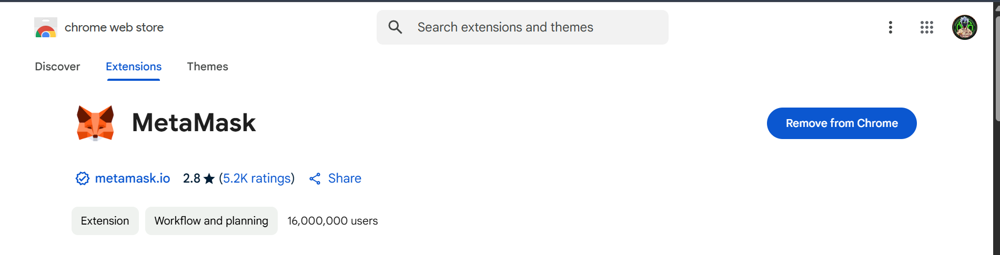
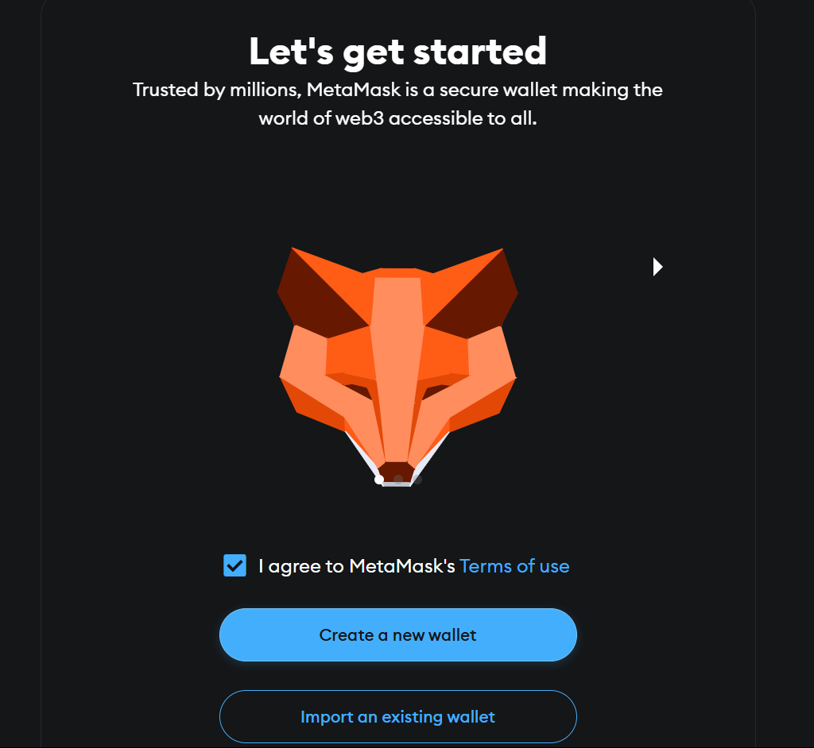
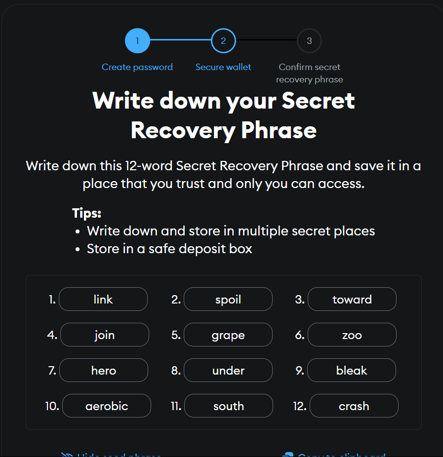
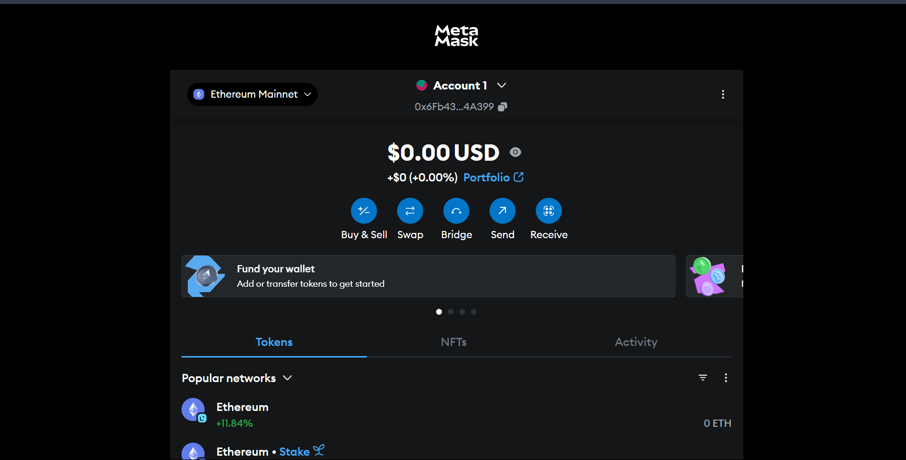
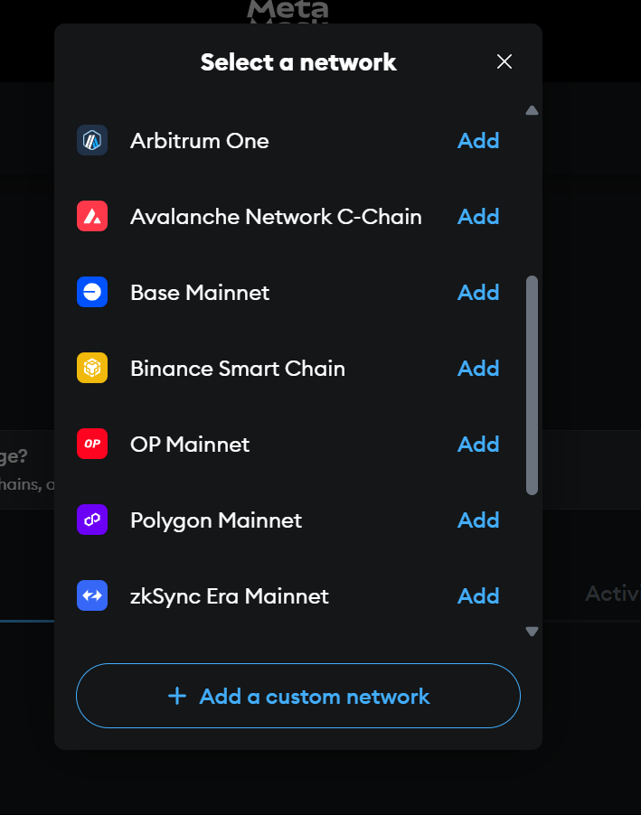
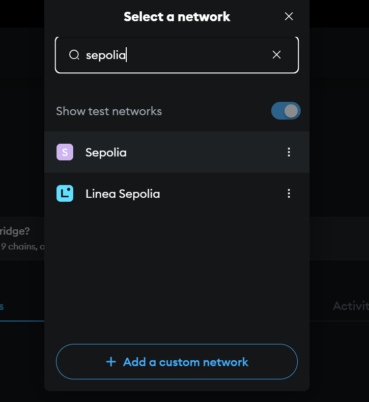
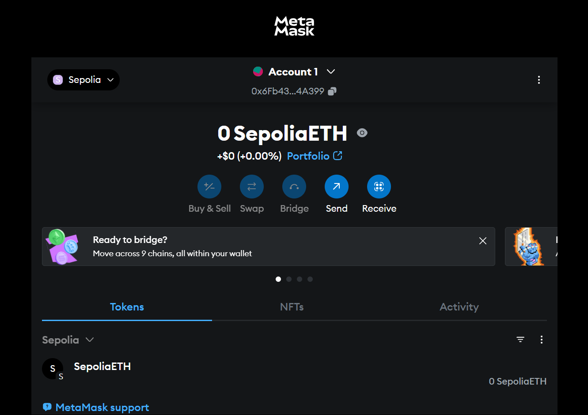

# MetaMask & Sepolia Test ETH Assignment

## Overview
This document explains how to use MetaMask with the Ethereum Sepolia Test Network. It includes steps for setting up MetaMask, configuring the Sepolia network, receiving test ETH from the Google Cloud Faucet, and transferring ETH between two accounts. This helps in understanding blockchain wallets, test networks, and transactions.

---

## Step 1: Create a MetaMask Wallet
To begin, a crypto wallet is needed. MetaMask is a widely used Ethereum wallet available as a browser extension.

### What Was Done:
- Installed the MetaMask browser extension.
- Created a new wallet.
- Saved the Secret Recovery Phrase securely.

### Screenshots:
1. MetaMask Download Page  
   
2. Create Wallet Screen  
   
3. Secret Recovery Phrase  
   
4. Wallet Homepage  
   

*Note: Never share your recovery phrase with anyone.*

---

## Step 2: Add the Sepolia Test Network
Since the Ethereum mainnet uses real ETH, test networks like Sepolia are used for practice.

### What Was Done:
- Opened MetaMask network settings.
- Selected or added the Sepolia Test Network.
- Switched from Ethereum mainnet to Sepolia.

### Screenshots:
1. Network Dropdown List  
   
2. Add Network Screen  
   
3. Sepolia Added Successfully  
   

*Note: Using test networks allows learning without using real money.*

---

## Step 3: Get Sepolia ETH from Faucet
Test ETH is required to simulate transactions.

### What Was Done:
- Visited the Google Cloud Faucet site.
- Pasted MetaMask wallet address.
- Clicked on "Request Tokens".
- Verified token receipt in MetaMask.

### Screenshots:
1. Faucet Homepage  
   
2. Request Tokens Clicked  
   
3. Drip Confirmation  
   
4. ETH Received in MetaMask  
   

*Note: Sepolia ETH is only for testing purposes and has no real value.*

---

## Step 4: Transfer Sepolia ETH Between Accounts
To simulate a real transaction, ETH was sent from one account to another.

### What Was Done:
- Created a second MetaMask account.
- Copied the new account's address.
- Used the first account to send 0.01 ETH to the second account.
- Verified the transfer.

### Screenshots:
1. Create Second Account  
   
2. Copy Receiver Address  
   
3. Send ETH from First Account  
   
4. Transaction Confirmation  
   
5. ETH Received in Second Account  
   

*Note: This simulates how blockchain transactions work.*

---

## Conclusion
This exercise demonstrated how to:
- Create and manage a MetaMask wallet
- Connect to a test network (Sepolia)
- Request and use test ETH
- Send ETH between accounts

These steps build a basic understanding of Ethereum wallets, testnets, and transactions in a development environment.

> **Learning Outcome:** Practical experience with wallets, test ETH, and network setup prepares users for blockchain development and testing.

